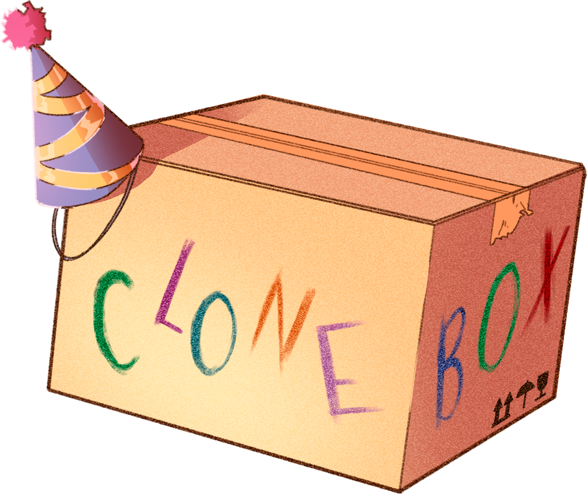
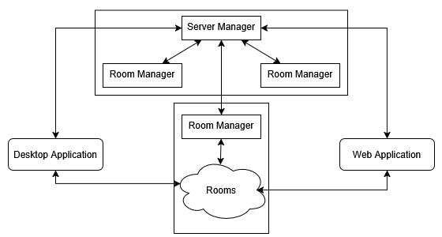

<p align="center" style="font-weight:bold; font-size:32px">
  Clone Box
</p>

<p align="center">
  
</p>

<p align="center">
  A party game manager system inspired by The Jackbox Games
</p

<p align="center">
	Made using:
</p>

<p align="center">
	<a href="https://www.typescriptlang.org/" target="blank"></a>
	<a href="https://nestjs.com/" target="blank"></a>
	<a href="https://www.solidjs.com/" target="blank"></a>
	<a href="https://tailwindcss.com/" target="blank"></a>
	<a href="https://unity.com/" target="blank"></a>
	<a href="https://go.dev/" target="blank"></a>
</p>

## What is the system

This system is inspired by [Jackbox Games](https://www.jackboxgames.com/) and aims to be similar to its structure, having a desktop app/game, that shows the shared screen, a web app, where the users connect and play from, a server that manages multiple room managers, and the room managers that manages the games, this is shown in the image below:

<p align="center">
  
</p>

There may be more than one room manager, in this way the rooms will be spread around all managers about equally, this can be done either by running the server process in another machine and adding its ip to the "servers.json" file, or by having an elastic cloud that creates these machines on demand, this approach needs to be adapted so it writes on the "servers.json", causing the server to automatically reload the servers list.

## How does it work

The system works by executing Game Rooms in Room Manager machines/servers, these maintain rooms being executed and the players in them, they respond to the Server Manager, that maintains one or more Room Managers and the amount of games in them, trying to balance the load between them all.

The users connect to the system via Web Application to play the game and via Desktop Application to start a new room, these than communicate via WebSockets/HTTP with the rooms to progess the game state.

## Starting the system

Start running the Room Managers (there may be more than one), you can start it with the following command in the NodeServers/room-manager directory:

```bash
$ npm run start
```

Whenever the Room Managers finished starting, you can run the Server Manager with the same command in the NodeServers/server-manager directory:

```bash
$ npm run start
```

The next system to start is the Web App, you also start it with the same command as the managers but in the WebClients/web directory:

```bash
$ npm run start
```

With these applications running the system is ready to be accessed. For more informations check the README in the directory of each system.

## How to make a game

To create a new game you are gonna code a new Scene, Controller and State in the Unity Game, new interfaces for the Web App, and the Game Room.

##### Unity Game

###### Scene

In the new Unity scene create the Canvas for the 2D interface and add the ExitButton Prefab (you can also make changes to this button, or create your own), hide it by default, as it only should appears on game end, user wanting to quit (e.g. pressing Esc key) or if there is an error in creating a room.

Add a interface that shows while the game awaits for the response of the server's response, anything that you like, even a text saying "Waiting for server..." is fine. You will also need an interface to show the players that are logged in, show the users' name, a picture for easier identification, room code and a QRCode for acessing the Web App.

The rest of interfaces should show the information of the game, it can be the current turn's player, a timer for waiting while players choose their plays, and their points, however this is up to you. All the interfaces, except the interface that waits for the server should be hidden by default, and it is the Controller's role to show and hide them whenever needed.

###### Controller

The controller maintains the variables to the root of each interface, so it can hide/show it when needed, the game timers (e.g. the time for the players to think/choose one of their options) and the communication with the server.

Your controller should be a C# script that extends the GameController (responsible for the defaults of a controller, like the default interfaces, the pictures for the users and creating the websocket).

In the inspector you have to set the connectPage to the game object of the connecting interface, the loginPage to the game object of the login interface, the QRCodeImg to the RawImage and codeText to the Text where the code should appear on the login interface. The base structure of a controller is:

```csharp
public class YourController : GameController
{
	// variables declarations

	async void Start()
	{
		sprites = Resources.LoadAll<Sprite>("Sprites/UserIcons"); // load all icons from UserIcons

		wsDelegate = WSCommunication; // set handler to websocket
		for(int i = 0; i < 10; i++){
			pictures[i] = String.Format("UserIcons_{0}", i);
		}
        	ShufflePictures();

		UnityWebRequest req = new UnityWebRequest(String.Format("{0}:{1}/createRoom", DotEnv.serverIp, DotEnv.serverPort), "POST");
        	byte[] jsonToSend = System.Text.Encoding.UTF8.GetBytes("{\"game\": \"YOUR_GAME\"}");
        	req.uploadHandler = (UploadHandler)new UploadHandlerRaw(jsonToSend);
        	req.downloadHandler = (DownloadHandler)new DownloadHandlerBuffer();
        	req.SetRequestHeader("Content-Type", "application/json");

        	UnityWebRequestAsyncOperation operation = req.SendWebRequest();

        	while (!operation.isDone) { }

	        if(req.result == UnityWebRequest.Result.ConnectionError){
        		// Show to user that it was unable to connect
        	}else{
			room = GameRoom.CreateFromJSON(req.downloadHandler.text);
			await createWS(String.Format("wss://{0}:{1}/unity", room._ip, room._port), wsDelegate);
        	}

	        exitPage.GetComponent<Button>().onClick.AddListener(Exit);
	}

	async void Update()
	{
		if(Input.GetKeyDown(KeyCode.Escape)){
            		exitPage.SetActive(!exitPage.activeSelf);
        	}
	        #if !UNITY_WEBGL || UNITY_EDITOR
            		if(ws != null){
                		ws.DispatchMessageQueue();
            		}
        	#endif
		if((gameState & YourGameState.Started) != 0){
			// game logic
		}
	}

	private async Task Quit()
	{
		if(room != null){
			UnityWebRequest req = new UnityWebRequest(String.Format("{0}:{1}/room/{2}/end", DotEnv.serverIp, DotEnv.serverPort, room._code), "GET");

            		UnityWebRequestAsyncOperation operation = req.SendWebRequest();

		        while (!operation.isDone) { }
            		SendWSMessage("YOUR END MESSAGE"); // send the message to finish the room
            		if(ws != null){
                		await ws.Close();
            		}
		}
	}

	private async void Exit()
    	{
        	await Quit();
        	exitPage.GetComponent<ExitGame>().Exit();
    	}

    	private async void OnApplicationQuit()
    	{
        	await Quit();
    	}

	void WSCommunication(byte[] bytes)
	{
		var msg = System.Text.Encoding.UTF8.GetString(bytes);
		// your websocket logic
	}
}
```

###### State

The state is a simple enum that is used as a Flag, this is used to control which timer is running and which actions should be taken, you can set it by a binary number, where each bit shows each state (e.g. the least significant bit shows that the game started).

```csharp
using System.Collections;
using System.Collections.Generic;
using System;

[Flags]
public enum YourGameState
{
    None    = 0b_0000_0000, // 0
    Started = 0b_0000_0001, // 1
    Waiting = 0b_0000_0010, // 2
    Playing  = 0b_0000_0100, // 4
    Points  = 0b_0000_1000  // 8
}
```

##### Web Application

This project uses SolidJS for the SPA and Tailwind CSS to stylize the user interface. To make a new game you have to create a new view for your game, as it will render all the possible actions during the game, after the file is done you should update index.tsx to add it as a route, like so:

```javascript
render(() => (
    <Router>
		<Route path="/" component={RoomLogin}/>
		<Route path="/minPlus" component={MinPlus}/>
		<Route path="/factOrFable" component={FactOrFable}/>
		<Route path="*paramName" component={RoomLogin}/>
		<Route path="/yourGame" component={YourGame}/>
        </Router>
), root!);
```

And in the views folder your YourGame.tsx should look like:

```typescript
import { Component, createEffect, createSignal, For, Show } from "solid-js";
import Header from "../components/GameHeader";
import Start from "../components/GameStart";
import { useLocation, useNavigate } from "@solidjs/router";
import { createWS } from "@solid-primitives/websocket";

const YourGame: Component = () => {
    const navigate = useNavigate();
    const location = useLocation();
    const { id, username, ip, port, gameState }: any = location.state || {};

    const [alerts, setAlerts] = createSignal<Record<string, string>>({});
    const [started, setStarted] = createSignal(gameState);

    var currGameState = sessionStorage.getItem("gameState");
    var minPlayersLogged: boolean = false;
    var ws = createWS(`ws://${ip}:${port}/user?id=${id}&username=${username}`);

    function checkLoadState(){
        // get values from sessionStorage
	// check which state the game was and set values accordingly
    }

    ws.addEventListener('close', () => {
        if(!sessionStorage.getItem("gameState")){
            ws = createWS(`ws://${ip}/user?id=${id}&username=${username}`);
        }
    });

    ws.addEventListener('open', () => {
	ws.send(""); // ask room how many players are logged
    });

    ws.addEventListener('message', () => {
	// communication logic
    });

    createEffect(() => checkLoadState());

    return (
	<div class="h-[100svh] flex flex-col items-center">
		<For each={Object.entries(alerts())}>
                	{([key, value]) => (
                   		<Alert message={value} title={key}></Alert>
                	)}
		</For>
            	<Header username={username} dark="#DARK_COLOR" light="#LIGHT_COLOR"/>
            	<Show when={id === 0 && !started()}>
                	<Start ws={ws} dark="#LIGHT_COLOR" secondary="#SECONDARY_COLOR"/>
            	</Show>
		{* remaining of your interface using Show *}
	</div>
    );
}

export default YourGame;
```

Stylize it as you like, you can define colors and custom classes in the index.css and use then in Tailwind CSS.

##### Game Room

This system ties all the interfaces together, it acts as a server to store the game state and exchange message between all web apps and the unity app.

The file for the room is written in Go and communicate with the web and unity via websocket or requests. To create a new game room, you should create a folder in the GoServers directory with the name of yourGame, then inside this folder all files related to that game. Compile the yourGame file with `go build` and change it to an executable, this way the room manager can execute the code. The default structure for the main file is:

```go
package main

import (
	"GoServers/gameserver"
	"encoding/json"
	"fmt"
	"log"
	"math/rand"
	"net/http"
	"os"
	"strconv"
	"strings"
	"sync"

	"github.com/gorilla/websocket"
) // these may vary from game to game

// game variables (e.g. points and answers)
// base functions, the functions needed for this game (e.g. play(), points())

func unityWebSocket(msg string, server *gameserver.GameServer, params map[string]any) {
	// communication between unity and this room
}

func usersWebSocket(msg string, server *gameserver.GameServer, params map[string]any) {
	// communication between web app and this room
}

func main() {
	var unityWS gameserver.WebsocketCallback = unityWebSocket
	var usersWS gameserver.WebsocketCallback = usersWebSocket
	var port string = ":" + os.Args[1]
	var gameServer gameserver.GameServer = gameserver.GameServer{
		RouteMap:    make(map[string]bool),
		UsernameMap: make(map[string]string),
		PointsMap:   make(map[string]int),
		UnityWS:     nil,
		UnityIP:     "",
		UnityFunc:   unityWS,
		UsersWS:     make(map[string]*websocket.Conn),
		UsersIP:     make(map[string]string),
		UsersFunc:   usersWS,
	}

	minPlayersArg, _ := strconv.Atoi(os.Args[2])
	gameServer.MinPlayers = minPlayersArg

	maxPlayersArg, _ := strconv.Atoi(os.Args[3])
	gameServer.MaxPlayers = maxPlayersArg
	fmt.Printf("YOUR_GAMGE running on port %s\n", port)

	httpServerExitDone := &sync.WaitGroup{}

	httpServerExitDone.Add(1)

	gameServer.Mux = http.NewServeMux()
	gameServer.Server = &http.Server{
		Addr:    port,
		Handler: gameServer.Mux,
	}

	// websockets routes
	gameServer.AddRoute("unity", func(w http.ResponseWriter, r *http.Request) {
		gameServer.UnityWebSocket(w, r)
	})
	gameServer.ToggleRoute("unity")

	gameServer.AddRoute("user", func(w http.ResponseWriter, r *http.Request) {
		gameServer.UserWebSocket(w, r)
	})
	gameServer.ToggleRoute("user")

	gameServer.AddRoute("ping", gameServer.PingPong)
	gameServer.ToggleRoute("ping")

	fillDeck()

	log.Fatalln(gameServer.Server.ListenAndServe())

	// wait for goroutine started in startHttpServer() to stop
	httpServerExitDone.Wait()

	fmt.Print("Game Finished")
}
```

You can get users answer from the websocket and handle them inside `usersWebSocket` or you can add a POST handler for it, in the latter you should add a handler to the server using `gameServer.AddRoute("route", func)` and toggle it whenever you want to be able to receive data from users using `gameServer.ToggleRoute("route")`, this forces the server to only process the request whenever you toggle it.

##### Tying everything together

For this approach to work you should define protocols for the websocket communication between Web/Room and Unity/Room.

In the examples in this project the messages exchanged always contain a number [0-9] (can be expanded to letters, or even more characters) to identify the command to run in either side of the socket, for example, everytime a user logs in, the room send a message with id "2" to unity followed by the username and the user's id, this action also send a message ("1MESSAGE") to the host (first user to log in) warning them that there are *k* more players needed or that they can start the game.

There are 2 reserved commands that should not be replaced, they are "2" in the Unity/Room socket and "1" in the Web/Room socket.

## Thanks

* [Rafael Rech](https://github.com/Rafael-Rech)
  * Designed the user icons for the unity client.
* [Jessé Santana Veloso](https://github.com/Jesse-SV)
  * Helped to design the interfaces and cards of the game Min Plus.
* [Gustavo Henrique Prudente](https://www.instagram.com/oguuhqueilustra/)
  * Designed for the logo/icon of clonebox.
